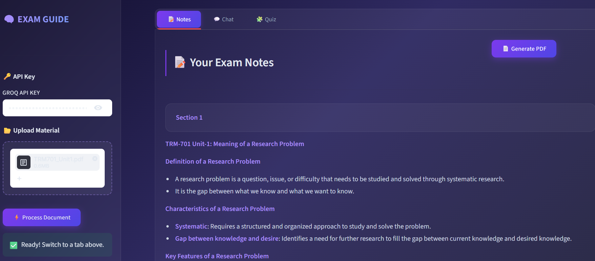
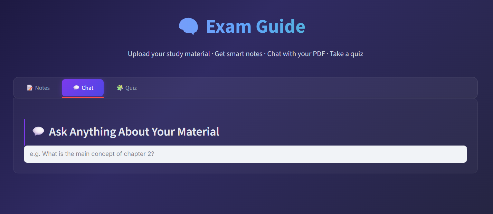
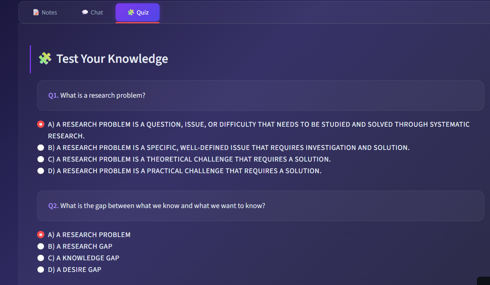

<div align="center">

# 📚 ExamGuide: AI-Powered Study Assistant

### *An Intelligent Retrieval-Augmented Generation (RAG) System for Smart Exam Preparation*

<p>
  
  
  
  
  
  
</p>

### Transform PDFs into structured exam-ready notes, chat intelligently with your documents through a Retrieval-Augmented Generation (RAG) pipeline, and strengthen learning with AI-generated quizzes.

</div>

---

# Project Preview

<p align="center">

</p>

> *Replace with the main application screenshot.*

---

# Overview

**ExamGuide** is an AI-powered study assistant designed to simplify and accelerate the learning process by combining **document understanding, semantic retrieval, prompt engineering, and large language models** into a single interactive platform.

Unlike conventional summarization tools that simply condense text, ExamGuide first builds a semantic understanding of uploaded documents and then leverages a **Retrieval-Augmented Generation (RAG) pipeline** to generate context-aware outputs.

The application enables users to:

- Generate structured, exam-oriented revision notes
- Chat with uploaded PDFs using semantic retrieval
- Ask questions grounded in document context
- Practice with automatically generated MCQ quizzes
- Export notes as PDF for offline revision

By integrating retrieval with generation, ExamGuide provides a significantly more reliable and personalized learning experience than standalone language models.

---

# Core AI Technologies

ExamGuide combines multiple modern AI concepts into a unified workflow:

- **Retrieval-Augmented Generation (RAG)**
- **Semantic Search**
- **Prompt Engineering**
- **Dense Vector Embeddings**
- **FAISS Vector Indexing**
- **Sentence Transformers**
- **Large Language Models (LLMs)**
- **Document Grounding**
- **AI-Generated Exam Notes**
- **Automatic MCQ Generation**

Rather than functioning as a simple chatbot, the system operates as a complete AI-powered study companion capable of understanding, retrieving, explaining, and evaluating educational content.

---

# LLM & AI Models Used

ExamGuide integrates multiple specialized AI models, each responsible for a different stage of the pipeline.

### 🧠 Large Language Model

The application uses **Meta's Llama 3.1 8B Instant** through the **Groq API** for:

- Exam-ready note generation
- Context-aware question answering
- Multiple-choice question generation
- Educational content formatting

The model operates with a **low temperature (0.2)** to produce more deterministic, consistent, and reliable outputs suitable for academic use.

---

### 🔍 Embedding Model

Semantic representations are generated using:

**Sentence Transformers – `all-MiniLM-L6-v2`**

Every document chunk is converted into a dense vector embedding that captures semantic meaning rather than exact keywords.

These embeddings enable meaning-based retrieval throughout the RAG pipeline.

---

# Why ExamGuide?

Most AI note generators produce summaries without actually understanding the underlying document.

ExamGuide instead implements a **Retrieval-Augmented Generation (RAG) architecture**, allowing the language model to retrieve relevant information before generating responses.

This results in:

- Better factual consistency
- Reduced hallucinations
- Context-aware answers
- Personalized explanations
- Interactive learning instead of passive summarization

The uploaded document effectively becomes the knowledge base from which the AI reasons.

---

# **How the RAG Engine Works**

At the heart of ExamGuide lies a complete **Retrieval-Augmented Generation (RAG) engine**.

Rather than answering directly from pretrained knowledge, every question follows a semantic retrieval process before generation.

The workflow consists of:

1. Converting the user's question into an embedding.
2. Searching the FAISS vector database using cosine similarity.
3. Retrieving the **three most relevant document chunks**.
4. Supplying retrieved context to the language model.
5. Generating a context-grounded response.

This architecture ensures that responses remain closely tied to the uploaded study material rather than relying purely on model memory.

---

# Semantic Retrieval Pipeline

```text
                 User Question
                        │
                        ▼
         Sentence Transformer Encoding
                        │
                        ▼
          Generate Query Embedding
                        │
                        ▼
          FAISS Cosine Similarity Search
                        │
                        ▼
         Retrieve Top 3 Relevant Chunks
                        │
                        ▼
        Context + User Prompt + LLM
                        │
                        ▼
          Context-Aware AI Response
```

---

# Key Features

## AI-Generated Exam Notes

ExamGuide automatically transforms lengthy PDFs into structured revision notes optimized for examination preparation.

Instead of generic summaries, carefully engineered prompts instruct the language model to produce:

- Hierarchical headings
- Organized bullet points
- Highlighted key concepts
- Exam-focused formatting
- Tables whenever appropriate

The generated notes are concise, readable, and designed specifically for efficient revision.

---

## Prompt Engineering

High-quality educational content requires more than simply passing text to an LLM.

ExamGuide uses carefully designed prompt templates that instruct the model to:

- Prioritize important concepts
- Organize information logically
- Produce revision-friendly notes
- Format outputs consistently
- Generate valid JSON for MCQ creation
- Maintain educational relevance throughout generation

These prompts significantly improve output quality and consistency compared to generic prompting.

---

## Intelligent Document Processing

Before any AI generation begins, uploaded PDFs undergo multiple preprocessing stages.

The pipeline performs:

- Text extraction using **PyMuPDF**
- Cleaning and whitespace normalization
- Intelligent recursive chunking
- Context preservation through overlapping chunks

The use of overlapping chunks helps maintain semantic continuity between neighboring sections of the document.

---

## Semantic Embedding Generation

Every chunk is encoded using the **all-MiniLM-L6-v2 Sentence Transformer model**.

Instead of keyword matching, embeddings capture semantic meaning, allowing conceptually similar passages to be retrieved even when different wording is used.

This significantly improves retrieval quality for natural language questions.

---

## FAISS-Powered Vector Search

Generated embeddings are converted to float32, **L2-normalized**, and indexed using **FAISS IndexFlatIP**.

This implementation enables efficient cosine similarity retrieval over the entire document and serves as the retrieval backbone of the RAG pipeline.

Rather than searching by exact keywords, the system searches by meaning.

---

## Context-Aware AI Chat

For every user question, ExamGuide:

- Converts the query into a semantic embedding
- Searches the FAISS vector database
- Retrieves the three most relevant chunks
- Injects retrieved context into the LLM prompt
- Produces a document-grounded response

This retrieval-first strategy greatly improves factual accuracy and contextual relevance.

---

## AI-Generated MCQ Quizzes

Beyond note generation, ExamGuide automatically creates multiple-choice quizzes from the processed study material.

The LLM is prompted to return quiz data in structured JSON format, enabling seamless parsing, automatic scoring, and interactive self-assessment.

These quizzes encourage active recall and reinforce long-term retention.

---

# End-to-End AI Pipeline

```text
                    Upload PDF
                         │
                         ▼
              Extract Text (PyMuPDF)
                         │
                         ▼
             Clean & Normalize Content
                         │
                         ▼
          Recursive Character Chunking
                 (2000 / 200 overlap)
                         │
                         ▼
     Generate Sentence Embeddings
       (all-MiniLM-L6-v2 Model)
                         │
                         ▼
        L2 Normalization + FAISS Index
                         │
          ┌──────────────┼───────────────┐
          │              │               │
          ▼              ▼               ▼
   Exam Notes      AI Chat (RAG)     MCQ Generator
          │              │               │
          ▼              ▼               ▼
   PDF Export     Top-3 Chunk       JSON Quiz
                   Retrieval         Generation
```

---

# Application Showcase

## Home Interface

<p align="center">

</p>

---

## Exam Notes

<p align="center">

</p>

---

## AI Chat

<p align="center">

</p>

---

## MCQ Quiz

<p align="center">

</p>

The application seamlessly combines semantic retrieval, prompt engineering, and large language models into a unified workflow that supports note generation, contextual question answering, and active learning through automated assessment.
# Installation

## Clone the Repository

```bash
git clone https://github.com/YOUR_USERNAME/ExamGuide.git
```

Navigate to the project directory:

```bash
cd ExamGuide
```

---

## Install Dependencies

```bash
pip install -r requirements.txt
```

---

## Launch the Application

```bash
streamlit run app.py
```

The application will open locally in your default web browser.

Alternatively, you can access the deployed version on Streamlit:

**🔗 Live Demo:**  
`https://your-streamlit-app-url`

---

# How It Works

1. The user uploads a PDF containing study material.

2. PyMuPDF extracts the text from the document.

3. The extracted text is cleaned and normalized to remove unnecessary formatting.

4. The document is divided into overlapping chunks using `RecursiveCharacterTextSplitter` to preserve contextual continuity.

5. Each chunk is converted into a dense semantic embedding using the `all-MiniLM-L6-v2` Sentence Transformer model.

6. The embeddings are L2-normalized and indexed using FAISS (`IndexFlatIP`) for efficient cosine similarity search.

7. Depending on the selected feature:
   - The LLM generates structured exam-ready notes.
   - The top three semantically relevant chunks are retrieved to answer user queries through the RAG pipeline.
   - The LLM generates multiple-choice questions in structured JSON format for interactive quizzes.

8. Generated notes can be exported as a PDF for offline revision.

---

# Technical Implementation

## Document Processing

Every uploaded PDF undergoes a preprocessing pipeline before AI generation begins.

The system:

- Extracts text using **PyMuPDF**
- Removes unnecessary whitespace and formatting artifacts
- Normalizes document structure
- Splits content using **RecursiveCharacterTextSplitter**
- Preserves contextual continuity through overlapping chunks

The chunking strategy uses:

- **Chunk Size:** 2000 characters
- **Chunk Overlap:** 200 characters

This overlap helps retain relationships between adjacent sections and improves retrieval quality.

---

## Semantic Embedding Generation

Each chunk is transformed into a dense vector representation using:

**Sentence Transformers – `all-MiniLM-L6-v2`**

Unlike keyword matching, embeddings capture semantic meaning, enabling the system to retrieve conceptually relevant passages even when wording differs.

These embeddings form the knowledge base for retrieval.

---

## Vector Database & Similarity Search

Generated embeddings are:

- Converted to `float32`
- L2 normalized
- Indexed using **FAISS IndexFlatIP**

This implementation effectively performs cosine similarity search and enables rapid semantic retrieval across the uploaded document.

When a user asks a question:

1. The query is embedded.
2. FAISS searches the vector index.
3. The **three most relevant chunks** are retrieved.
4. Retrieved context is injected into the LLM prompt.

This retrieval-first approach significantly improves contextual relevance while minimizing hallucinations.

---

## Large Language Model Integration

ExamGuide uses:

**Meta Llama 3.1 8B Instant**  
**Served through the Groq API**

The LLM powers:

- Exam note generation
- Context-aware question answering
- Multiple-choice question creation

Generation is performed with a **temperature of 0.2**, producing more deterministic and academically consistent outputs.

---

## Prompt Engineering Strategy

Rather than relying on generic prompting, ExamGuide uses specialized prompt templates tailored for educational tasks.

### Notes Generation

The model is instructed to produce:

- Structured headings
- Bullet points
- Highlighted key concepts
- Tables whenever appropriate
- Revision-friendly formatting

Instead of simple summaries, outputs resemble curated study notes.

### Question Answering

The chatbot receives:

- Retrieved document context
- User question

and is explicitly instructed to answer **only using the supplied context**, ensuring responses remain grounded in the uploaded material.

### MCQ Generation

The model generates quizzes in **strict JSON format**, enabling:

- Automatic parsing
- Interactive radio-button quizzes
- Instant evaluation
- Accurate score calculation

This structured prompting improves reliability and simplifies downstream processing.

---

# Why Retrieval-Augmented Generation?

Traditional language models answer primarily from pretrained knowledge, which can lead to hallucinations or responses unrelated to the uploaded material.

ExamGuide instead implements a complete **Retrieval-Augmented Generation (RAG) pipeline**.

Before generating an answer:

- The question is embedded.
- Similar document chunks are retrieved.
- Retrieved context is attached to the prompt.
- The language model reasons over that context.

This architecture enables responses that are grounded in the user's own study material rather than relying solely on model memory.

---

# Technology Stack

## Programming Language

- Python

## Frontend

- Streamlit

## Large Language Model

- Meta Llama 3.1 8B Instant
- Groq API

## Embedding Model

- Sentence Transformers (`all-MiniLM-L6-v2`)

## Retrieval System

- FAISS
- IndexFlatIP
- Cosine Similarity Search

## Document Processing

- PyMuPDF
- RecursiveCharacterTextSplitter

## Data Processing

- NumPy

## PDF Generation

- FPDF

## State Management

- Streamlit Session State

---

# Project Structure

```text
ExamGuide/
│
├── app.py
├── requirements.txt
├── README.md
│
├── assets/
│   ├── homepage.png
│   ├── notes.png
│   ├── chat.png
│   ├── quiz.png
│   └── architecture.png
│
└── temp/
```

---

# Key Advantages

Compared to conventional AI note generators, ExamGuide offers:

| Traditional Summarizers | ExamGuide |
|-------------------------|-----------|
| Static summaries | Interactive AI study assistant |
| Keyword search | Semantic vector retrieval |
| Generic chatbot | Context-grounded RAG chatbot |
| Passive reading | Active learning through quizzes |
| Manual revision | AI-generated exam notes |
| No personalization | Answers based on uploaded PDFs |
| Limited understanding | Semantic document comprehension |

---

# Future Enhancements

The architecture is designed to be extensible and can be expanded with:

- Multi-document knowledge bases
- OCR support for scanned PDFs
- Flashcard generation
- Adaptive quizzes based on performance
- Citation-aware answers
- Voice interaction
- Personalized revision schedules
- Image and diagram understanding
- Multi-language document support

---

# Learning Outcomes

This project demonstrates practical implementation of:

- Retrieval-Augmented Generation (RAG)
- Semantic Search
- Vector Embeddings
- FAISS Vector Databases
- Prompt Engineering
- Large Language Models
- Sentence Transformers
- Context-Aware Conversational AI
- AI-Powered Note Generation
- Automated Quiz Generation
- PDF Processing
- Interactive Web Applications

It showcases how modern retrieval systems and language models can be integrated into a complete educational platform rather than functioning as isolated AI components.

---

# Disclaimer

ExamGuide is intended for educational and research purposes.

While it provides context-aware notes and answers based on uploaded documents, users should always verify generated content against original study material when preparing for examinations or academic work.

---

<div align="center">

## ⭐ If you found this project useful, consider giving it a star!

### **ExamGuide: AI-Powered Study Assistant**

*Built using Retrieval-Augmented Generation (RAG), Semantic Search, Prompt Engineering, FAISS Vector Search, and Meta Llama 3.1 8B Instant to transform static PDFs into an intelligent, interactive learning experience.*

</div>
